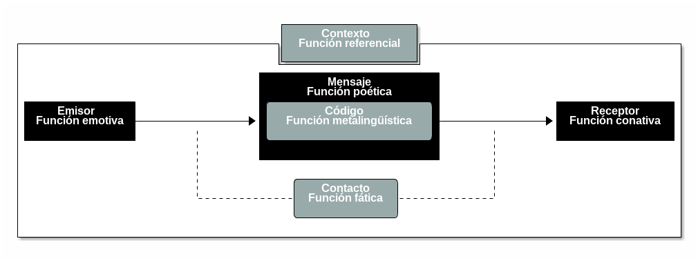

# Comunicación y lenguaje

## Proceso de comunicación {#procesoComunicacion}

La comunicación es el cálculo constante de intenciones. El modelo inferencial de la comunicación
consiste en  la evaluación  de hipótesis,  la que  mejor satisface  ciertas expectativas  de los
hablantes  en  el   intercambio  comunicativo  se  selecciona  como   significado  del  mensaje.
Leer {{ "grice1975logic" | cite }}

Los elementos del circuito comunicativo son:

* Emisor. Ligado a la función emotiva.
* Receptor. Ligado a la función conativa.
* Contexto. Ligado a la función referencial.
* Código. Ligado a la función metalingüística.
* Contacto. Ligado a la función fática.
* Mensaje. Ligado a la función poética.

### Principio de cooperación {#principioCooperacion}

El principio de cooperación  es la forma en la que Grice describe  el comportamiento. Se basa en
una serie de máximas que pueden o no ser acatadas.

* Cantidad \(informatividad\),
* Calidad \(verdad\),
* Relación \(relevancia\),
* Manera \(claridad\).

## Lenguaje: definición, tipos y características {#lenguaje}

El lenguaje es la facultad de asociar dos  ordenes distintos de entidades: orden de contenidos y
orden de la expresión, esto hace al lenguaje biplanar.[^1]

### Características {#caracteristicas}
* Congénito: Se nace con la capacidad.
* Relativa inmutabilidad: No se altera con el tiempo.
* Universalidad: No existe pueblo que no tenga esta facultad.
* No puede ser olvidado o aprendido.
* Indiferencia  ante cualquier tipo  de expresión: La facultad  del lenguaje tendrá  los canales
  para actualizarse sin importar la lengua.
* Límites: A las posibilidades de asociar expresión y contenido. La forma de la gramática de las
  lenguas la impone la naturaleza del lenguaje.

## Relación entre lenguaje, lengua y habla {#relacion}

El lenguaje es la capacidad. La lengua es el  producto social de la facultad del lenguaje, es la
suma de todas las  imágenes verbales almacenadas en todos los individuos. El  habla es la lengua
en uso.

## Diferencias entre lengua oral y lengua escrita {#diferencias}

La lengua escrita es la expresión psíquica directa del pensamiento.

## Estructura y función gramatical de palabras y oraciones[^2] {#estructura}

### Terminología {#terminologia}

* Morfología: Afijos que toma \(morfemas\).
* Distribución: Posición sintáctica del elemento. A que otros elementos modifica.
* Función sintáctica: Relación particular que el elemento tiene respecto a otros.
* Constituyente: Elemento que  ayuda a integrar un elemento más  complejos nivel sintáctico. Sus
  elementos no se pueden separar.
* Argumento: Número  de participantes  que requiere  un elemento  \(principalmente verbos\)  para
  manifestar plenamente su significado.

### Clases de palabras {#clases}

1. Nombres
   * Morfología: Género, número, caso, diminutivo, aumentativo
   * Función sintáctica: Son argumentos, objetos y  complemento de preposición. Aparecen después de
     determinantes y antes de adjetivos.
   * Distribución: Hay \[N\]
2. Verbo
   * Morfología: Persona, número, tiempo, aspecto, modo, voz
   * Función  sintáctica: Solo funcionan  como predicados,  modificados por adverbios,  pueden ser
     negados, toman argumentos, pueden acompañarse de auxiliares.
   * Distribución: 1\) Cambiar a infinitivo. 2\) Hay que \[V\], Hay que \[V\] eso
3. Adjetivo
   * Morfología: Número, género, grado \(superlativo, comparativo, positivo\)
   * Función  sintáctica:   Aparecen  entre  el  determinante  y  el   nombre  o  después  del
     nombre. Modificados por intensificadores o adverbios. Funcionan como predicados.
   * Distribución: Esta muy \[A\], Es muy \[A\]
4. Adverbios
   * Morfología: Derivan de adjetivos por medio de -mente
   * Función sintáctica:  Modifican verbos y adjetivos. Aparecen antes  de adjetivos. Modifican
     otros adverbios. En ciertos contextos se comportan como adjetivos.
5. Preposiciones
   Toman una FN como término o complemento: a, ante, bajo, cabe\(cerca de, junto a\), con, contra,
   de, desde,  durante[^3], en,  entre, hacia,  hasta, mediante[^4], para,  por, según,  sin, so
   \(bajo, debajo de\), sobre, tras, vía[^5] \(por, pasando por, haciendo escala en\)
6. Determinantes
   * Artículos: El, la, un, una, los, las...
   * Cuantificadores: Pocos, muchos ninguno, todas, tantos...
   * Numerales: Uno, dos, tres...
   * Posesivos: Mi, tu, su...
   * Demostrativos: Este, ese, aquellos...
7. Conjunciones
   * y, u, ni, pero...
8. Complementantes
   * que, si, donde.

### Relaciones Gramaticales {#relaciones}

1. Sujeto
   * Concuerda con el verbo
   * Sustituible por pronombre de sujeto
   * Puede omitirse siempre
   * Se degrada en voz pasiva a complemento agente
   * Responde a preguntas eco: ¿Quién \[FV\]?, ¿Qué \[FV\]?
2. Objeto
   * Sustituible por clítico de objeto
   * Llevan marca de acusativo cuando es +animado y definido
   * Se pone en posición de foco y se duplica con clítico de objeto
   * Responde a preguntas: ¿Qué es lo \[Vparticipio\]?
   * Voz pasiva: se promueve a sujeto
3. Oblicuos
   * Requieren marca especial \(preposición\)
   * Objetos indirectos
   * Son argumentos del verbo
   * Sustituibles por clítico de dativo
   * El clítico coexiste con la FP que es OI
   * Usan la preposición 'a' \(meta\) y 'para' \(benefactivo\)
   * Responden  preguntas: ¿A quién \[V\]?, ¿Para quién es lo \[V\]?
   * Adjuntos
   * No son requeridos por el verbo
   * Tipos: de razón-motivo, modo, tiempo, instrumento, lugar

### Otros puntos a tratar {#otros}

* Definición de núcleo y principio de endocentrismo.
* Lengua pro-drop.
* Orden de la lengua española \(**SVO**\).
* Noción de palabra.
* Enunciado, oración, clausula y finitud.
* Ambigüedad y sus tipos.

---

[^1]: Los detalles sobre este tema se abarcan en {{ "simone2001fundamentos" | cite }}.

[^2]: Para explicaciones más detalladas es importante leer {{ "espanola2009nueva" | cite }} y {{ "de2007gramatica" | cite }}.

[^3]: Tiene valor prepositivo, no es en realidad una preposición.

[^4]: Tiene valor prepositivo, no es en realidad una preposición.

[^5]: Tiene valor prepositivo, no es en realidad una preposición.

